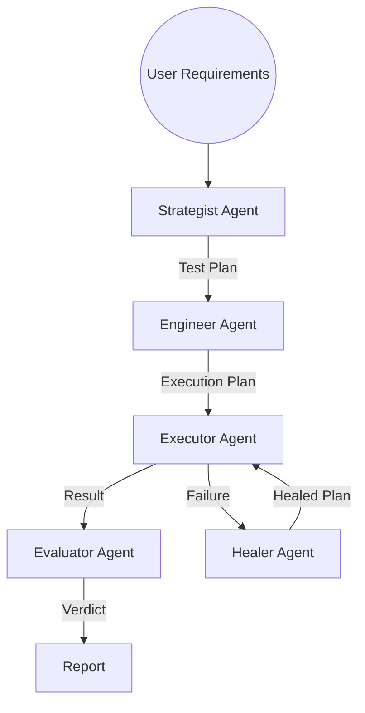

# Aptest Quality Engineering Tool

An AI-powered application for generating comprehensive Quality Engineering artifacts.

## Features

*   **Generate Test Artifacts**: Creates Test Strategy, Test Cases, Boundary Value Analysis, Test Data, and more using Google Gemini Pro.
*   **Flexible Input**: Accepts text prompts, website URLs, and document uploads (PDF/Text) as context.
*   **Test Case Repository**: Includes a starter library of test strategies for common domains (Netflix, Google News, Car Insurance, etc.).
*   **Modern UI**: Built with Flask and Bootstrap 5.

## Installation

1.  Clone the repository.
2.  Install dependencies:
    ```bash
    pip install -r requirements.txt
    ```
3.  Populate the starter data:
    ```bash
    python populate_data.py
    ```

## Usage

1.  Run the application:
    ```bash
    python run.py
    ```
2.  Open your browser and navigate to `http://localhost:5000`.
3.  Enter your Google Gemini API Key.
4.  Provide the context (Text, URL, or File) and click "Generate Artifacts".
5.  View, print, or save the generated artifacts.

## Project Structure

*   `app/`: Core application code.
    *   `__init__.py`: Flask app initialization.
    *   `routes.py`: URL routing and view logic.
    *   `utils.py`: Helper functions for LLM integration and text extraction.
    *   `templates/`: HTML templates.
    *   `static/`: CSS and JS files.
    *   `data/`: Data storage (JSON).
*   `run.py`: Entry point.
*   `populate_data.py`: Script to generate starter data.
*   `test_*.py`: Unit and integration tests.

## Requirements

*   Python 3.8+
*   Google Gemini API Key

---

# Autonomous Agentic QA System (New)

A state-of-the-art Quality Assurance system powered by Agentic AI, designed to autonomously generate, execute, and self-heal test cases.

## Architecture



## Core Components

### 1. The Strategist (Architect)
- **Role**: Analyzes requirements (PRDs, User Stories) to formulate a comprehensive testing strategy.
- **Output**: A structured TestPlan JSON object containing prioritized TestScenarios.

### 2. The Engineer (Implementer)
- **Role**: Transmutes high-level scenarios into executable technical instructions (tool calls).
- **Output**: A sequence of Abstract Tool Calls for the Executor.

### 3. The Executor (Driver)
- **Role**: Interacts with the System Under Test (SUT) via the Model Context Protocol (MCP).
- **Tooling**: Playwright for browser automation.

### 4. The Healer (Resilience Engine)
- **Role**: Analyzes failures (screenshots, DOM snapshots) to self-heal the test.
- **Method**: Uses Vision-Language Models (VLMs) to identify semantic matches for broken selectors.

### 5. The Evaluator (Judge)
- **Role**: Determines the pass/fail verdict based on Acceptance Criteria.

## Installation & Usage

1.  **Install Dependencies**:
    ```bash
    pip install -r requirements_agentic.txt
    ```

2.  **Run the System**:
    ```bash
    PYTHONPATH=. python src/main.py
    ```

## Directory Structure

*   `src/agents/`: Logic for Strategist, Engineer, Executor, Healer, Evaluator.
*   `src/state/`: Pydantic models for shared state.
*   `src/tools/`: MCP Server and Tool definitions (Playwright).
*   `src/workflows/`: LangGraph orchestration logic.
*   `src/main.py`: Entry point for the agentic workflow.

## Key Features

*   **Self-Healing**: Automatically recovers from UI changes (e.g., modified CSS selectors).
*   **Human-in-the-Loop**: Checkpoints allow manual review of test plans before execution.
*   **Model Context Protocol (MCP)**: Standardized interface for tool interaction.
