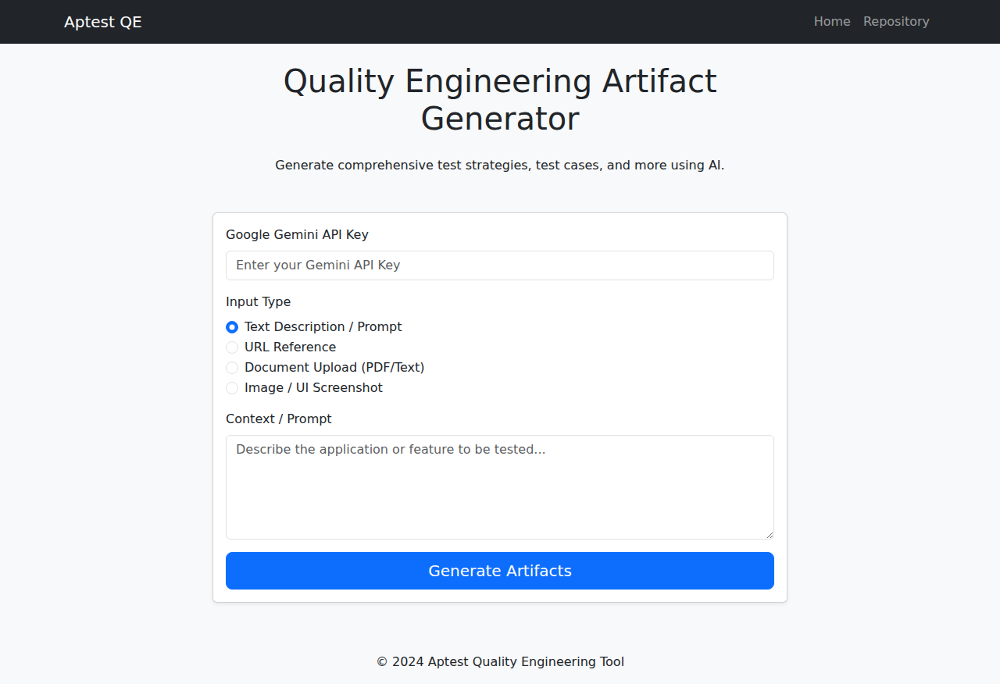
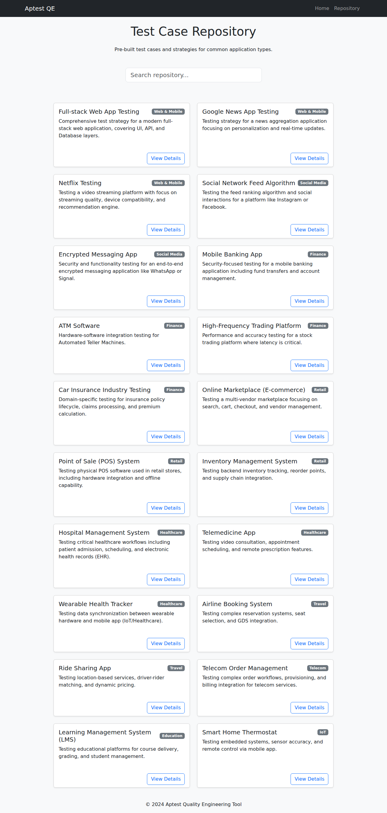

# Quality Engineering Artifact Generator

A comprehensive, AI-powered tool for generating Quality Engineering artifacts, including Test Strategies, Test Cases, Data, and more. Built with Flask and Google Gemini Pro.

## Features

*   **AI-Powered Generation:** connect to Google Gemini Pro to generate detailed testing artifacts.
*   **Multimodal Input:**
    *   **Text:** Describe the feature or application.
    *   **URL:** Provide a link to a website or documentation.
    *   **File:** Upload PDF or Text documents.
    *   **Image:** Upload UI screenshots or diagrams (uses `gemini-1.5-flash`).
*   **Test Case Repository:** A built-in library of pre-defined test cases for various industries (Finance, Healthcare, Retail, etc.).
*   **Searchable Repository:** Quickly find relevant test cases.
*   **Downloadable Results:** Save generated artifacts as Markdown files.
*   **Progressive Web App (PWA):** Installable on mobile and desktop devices with offline support for core assets.
*   **Mobile-First Design:** Responsive UI optimized for all screen sizes.

## Screenshots

| Home | Repository |
|---|---|
|  |  |

## Installation

1.  **Clone the repository:**
    ```bash
    git clone <repository-url>
    cd <repository-directory>
    ```

2.  **Create a virtual environment:**
    ```bash
    python3 -m venv venv
    source venv/bin/activate
    ```

3.  **Install dependencies:**
    ```bash
    pip install -r requirements.txt
    ```

4.  **Run the application:**
    ```bash
    python3 run.py
    ```

5.  **Access the app:**
    Open your browser and navigate to `http://127.0.0.1:5000`.

## Usage

1.  **Enter API Key:** You need a valid Google Gemini API Key.
2.  **Select Input Type:** Choose between Text, URL, File, or Image.
3.  **Provide Context:** Enter the prompt, URL, or upload the file/image.
4.  **Generate:** Click "Generate Artifacts" and wait for the AI to process your request.
5.  **View & Download:** Review the generated strategy and test cases. You can download the result as a Markdown file or print/save as PDF.

## Technologies

*   **Backend:** Python, Flask
*   **AI:** Google Gemini Pro (`google-generativeai`)
*   **Frontend:** HTML5, CSS3, Bootstrap 5
*   **PWA:** Service Worker, Manifest
*   **Utilities:** BeautifulSoup4 (Web Scraping), PyPDF (PDF Parsing), Pillow (Image Processing)

## License

MIT
