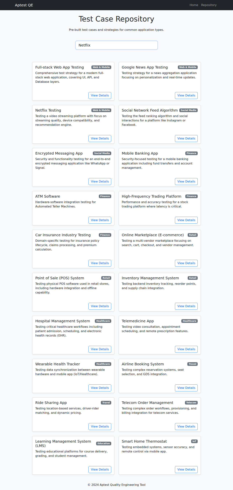

# Quality Engineering Artifact Generator

<div align="center">
  
  
  
  
  <br>
  <strong>A comprehensive, AI-powered tool for generating Quality Engineering artifacts.</strong>
</div>

---

## 📖 Overview

The **Quality Engineering Artifact Generator** is a full-stack Progressive Web Application (PWA) designed to assist Quality Engineers in creating robust testing documentation. By leveraging the power of **Google Gemini Pro**, the tool analyzes various input formats (Text, URL, Files, Images) and generates detailed test strategies, test cases, boundary conditions, and more.

## ✨ Features

*   **🤖 AI-Powered Generation:** Connects to Google Gemini Pro/Flash to generate detailed testing artifacts.
*   **📷 Multimodal Input:**
    *   **Text:** Describe the feature or application.
    *   **URL:** Provide a link to a website or documentation for analysis.
    *   **File:** Upload PDF or Text documents.
    *   **Image:** Upload UI screenshots or diagrams (uses `gemini-1.5-flash`).
*   **📚 Test Case Repository:** A built-in, searchable library of pre-defined test cases for various industries (Finance, Healthcare, Retail, etc.).
*   **🔍 Advanced Search:** Filter repository items by keyword and category.
*   **⬇️ Downloadable Results:** Save generated artifacts as Markdown files or print/save as PDF.
*   **📱 Progressive Web App (PWA):** Installable on mobile and desktop devices with offline support for core assets.
*   **🎨 Modern UI:** Responsive, mobile-first design with a clean interface.

## 📸 Screenshots

| Home Screen | Repository |
|:---:|:---:|
|  |  |

| Search Functionality | Generated Result |
|:---:|:---:|
|  | *Generated artifacts are displayed in a clean, formatted view.* |

## 🚀 Installation & Setup

### Prerequisites

*   Python 3.9 or higher
*   A valid [Google Gemini API Key](https://aistudio.google.com/app/apikey)

### Steps

1.  **Clone the repository:**
    ```bash
    git clone https://github.com/your-username/qe-artifact-generator.git
    cd qe-artifact-generator
    ```

2.  **Create a virtual environment:**
    ```bash
    python3 -m venv venv
    source venv/bin/activate  # On Windows: venv\Scripts\activate
    ```

3.  **Install dependencies:**
    ```bash
    pip install -r requirements.txt
    ```

4.  **Run the application:**
    ```bash
    python3 run.py
    ```

5.  **Access the app:**
    Open your browser and navigate to `http://127.0.0.1:5000`.

## 🛠️ Usage

1.  **Enter API Key:** You need a valid Google Gemini API Key.
2.  **Select Input Type:** Choose between Text, URL, File, or Image.
3.  **Provide Context:** Enter the prompt, URL, or upload the file/image.
4.  **Generate:** Click "Generate Artifacts" and wait for the AI to process your request.
5.  **View & Download:** Review the generated strategy and test cases. You can download the result as a Markdown file or print/save as PDF.

## 🧰 Technologies Used

*   **Backend:** Python, Flask
*   **AI Models:** Google Gemini Pro (Text), Gemini 1.5 Flash (Vision)
*   **Frontend:** HTML5, CSS3, Bootstrap 5, FontAwesome
*   **PWA:** Service Worker, Web Manifest
*   **Utilities:**
    *   `beautifulsoup4`: Web content extraction
    *   `pypdf`: PDF text extraction
    *   `Pillow`: Image processing

## 📄 License

This project is licensed under the MIT License - see the [LICENSE](LICENSE) file for details.

---

<div align="center">
  <sub>Built with ❤️ by Jules</sub>
</div>
